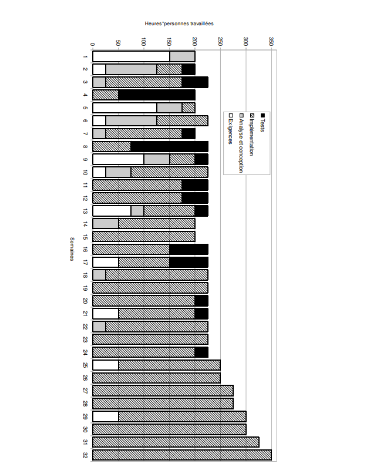

# Pré-CQI - Ingénierie logicielle

## Question 4 - Analyse quantitative de processus (3 points)

Vous êtes gestionnaire d’une équipe de maintenance pour une grande organisation. D’autres équipes sont responsables de développer les logiciels de l’organisation. La responsabilité de votre équipe se limite à la maintenance des logiciels développés. Une des équipes de développement vient tout juste de livrer un nouveau logiciel, et vous vous retrouvez maintenant responsable de la maintenance. Vous avez cependant entendu parler des difficultés rencontrées lors du développement de ce logiciel, ce qui vous laisse soupçonner que ce sera un défi pour votre équipe de maintenance. 

Vous réussissez à mettre la main sur les données de déroulement du développement logiciel. Ce logiciel a été développé en 32 semaines par une équipe de six personnes. Ces six personnes travaillaient à temps plein sur ce projet, ce qui signifie des horaires de 37,5 heures par personne par semaine, ou bien 225 heures*personnes par semaine pour l’ensemble de l’équipe. 

La Figure ci-dessous présente le détail de l’effort passé sur le projet, selon les quatre disciplines principales du développement logiciel.

Maintenant:
a) Sur la base de la Figure, décrivez le cycle de vie utilisé pour le développement de ce nouveau logiciel.

b) Sur la base du cycle de vie et des données de la Figure, décrivez des problèmes potentiels que ce nouveau logiciel pourrait avoir et qui pourraient concerner la maintenance.

c) En tant que gestionnaire de l’équipe de maintenance, et sur la base des problèmes décrits précédemment, que feriez-vous afin de mitiger les défis de maintenance apportés par ce nouveau
logiciel ?